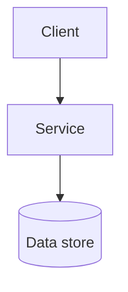

# Docs scaffold and PR template

Create these verbatim as a starting skeleton, then fill in the placeholders for the actual project. Keep them terse - these are working references, not essays.

## `AGENTS.md`

```markdown
# AGENTS.md

Instructions for coding agents working in this repository.

## Before every change is considered done

Run the same hooks CI runs:

    pre-commit run --files <changed files>

Or everything:

    pre-commit run --all-files

Do not skip hooks and do not commit with `--no-verify`. If a hook fails, fix the underlying issue rather than working around it.

## Docs map

- Architecture and design: [docs/ARCHITECTURE.md](docs/ARCHITECTURE.md)
- Product/functional/non-functional requirements: [docs/REQUIREMENTS.md](docs/REQUIREMENTS.md)
- Development workflow (setup, run, test, deploy, release): [docs/DEVELOPMENT.md](docs/DEVELOPMENT.md)
- Platform standards (MUST/SHOULD/MAY): [docs/STANDARDS.md](docs/STANDARDS.md)
- User guide: [docs/USAGE.md](docs/USAGE.md)
- Operational runbooks: [docs/OPS.md](docs/OPS.md)

## Task tracking and planning

- Track work as GitHub Issues, not a TODO file or doc.
- When you enter plan mode, write the plan to `docs/plans/<descriptive-kebab-case-name>.md` (not `.claude/plans/`) so it's versioned and visible alongside the code.

## Rules

- Every code change needs unit test coverage. The suite fails below 90% line coverage.
- Keep the whole unit test suite under 5 minutes.
- Commits must be signed.
- Conventional Commits (`feat:`, `fix:`, `feat!:` / `BREAKING CHANGE:`, etc.) drive versioning and the changelog - use them correctly.
- Python dependency management is uv only: `uv add`/`uv add --dev`, `uv sync`, `uv run`. No bare `pip install`, poetry, or pipenv.
- Prefer best-of-breed, open source, well-maintained tools and hosted services with generous free tiers. Design for a small resource footprint - see `docs/STANDARDS.md`.
- Don't add eval, memory, observability, or MCP tooling speculatively - only when the project actually needs it.
```

## `CLAUDE.md`

```markdown
# CLAUDE.md

See [AGENTS.md](AGENTS.md) - that file is authoritative for how agents should work in this repo.
```

## `docs/ARCHITECTURE.md`

````markdown
# Architecture

## Key design principles

- Best-of-breed, open source, well-maintained tools over novelty or convenience.
- Frugal by default - hosted services with generous free tiers, small resource footprint, no infrastructure paid for "just in case."
- <principle>

## Component architecture



## Technology stack

| Layer | Choice |
| --- | --- |
| Language | |
| Framework | |
| Data store | |
| Hosting | |

## Concepts and object model

- **<Concept>** - <one-line definition>
````

## `docs/REQUIREMENTS.md`

```markdown
# Requirements

## Product requirements

<What problem this solves, for whom, in a paragraph.>

## Functional requirements

### <Persona> - <role/context>

- As a <persona>, I want to <action>, so that <goal>.

## Non-functional requirements

- Performance: 
- Availability: 
- Security: 
- Scalability: 
```

## `docs/DEVELOPMENT.md`

```markdown
# Development

## Setup

    <install steps>   # Python: `uv sync`

## Run locally

    <run command>     # Python: `uv run <entrypoint>`

## Test

    pre-commit run --all-files
    <test command>    # Python: `uv run pytest`

Coverage gate is 90% lines; full suite must stay under 5 minutes.

## Deploy

<local/staging deploy steps>

## Release

Conventional Commits drive release-please. Merging its release PR tags a version, updates CHANGELOG.md, and triggers the publish workflow. See `.github/workflows/release-please.yml` and `.github/workflows/publish.yml`.

## Docs site

This `docs/` folder (except `docs/plans/`) publishes to GitHub Pages automatically on every merge to `main` via `.github/workflows/docs.yml`. Preview locally with `uv run --project docs mkdocs serve`.

## Task tracking and planning

Work is tracked as GitHub Issues, not a TODO file. Plan-mode plans live in `docs/plans/<descriptive-name>.md`.
```

## `docs/STANDARDS.md`

```markdown
# Standards

MUST / SHOULD / MAY / MUST NOT / SHOULD NOT rules that all code in this repo must follow.

## Data encryption and isolation

- MUST 
- MUST NOT 

## Security and compliance

- MUST 
- SHOULD 

## Naming conventions

- MUST 
- SHOULD 

## Tooling and dependencies

- MUST choose open source, actively maintained tools over closed-source or abandoned ones, absent a specific reason otherwise.
- MUST manage Python dependencies with uv (`uv add`, `uv sync`, `uv run`) - MUST NOT use bare `pip install`, poetry, or pipenv.
- SHOULD prefer hosted services with generous free tiers over self-hosting or paid tiers, until usage genuinely outgrows them.
- SHOULD design for a small resource footprint - fewer moving parts, lower idle cost.
- SHOULD NOT add evals (DeepEval/promptfoo), memory (supermemory), observability (Langfuse), or MCP tooling until the project has a concrete need for it.
```

## `docs/USAGE.md`

```markdown
# Usage

## Key features

- <feature> - <one line>

## Getting started

<how a user actually uses this>
```

## `docs/OPS.md`

```markdown
# Operations

## Observability

<dashboards, logs, metrics, where to find them>

## Troubleshooting

### <symptom>

- Likely cause: 
- Fix: 
```

## `docs/plans/README.md`

Git doesn't track empty directories, so seed the folder with this placeholder:

```markdown
# Plans

Plan-mode output for this repo lands here, one file per plan: `<descriptive-kebab-case-name>.md`. This is a project-specific override of the usual `.claude/plans/` location, so plans stay versioned and visible alongside the code.
```

## `.github/pull_request_template.md`

```markdown
## RATIONALE

<!-- 2-3 sentences: why this change -->

## NOTES

<!-- Screenshots, context for reviewers, risks, how you tested it -->
```
